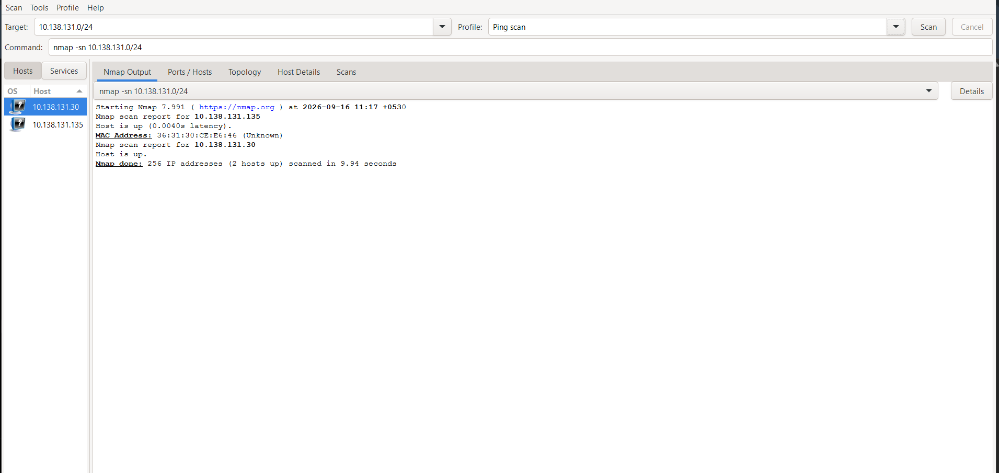
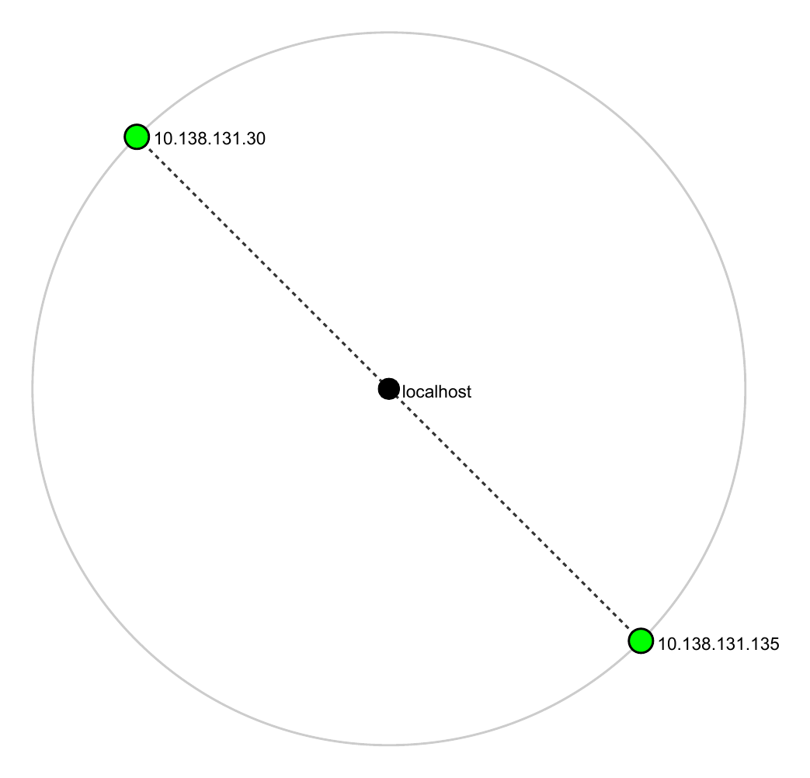
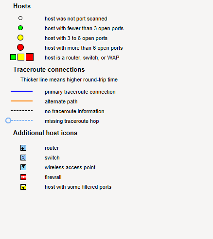

# W2-PM5 – Network Scanning with Zenmap

## Project Overview

This project documents a basic network-scanning exercise using Zenmap, the graphical user interface for Nmap. The scan was performed only on an authorized local network to identify the local subnet, discover active hosts, record available MAC-address information, and save network topology evidence.

## Target

- **Target Subnet:** `10.138.131.0/24`
- **Assessment Type:** Network scanning and live-host discovery
- **Operating System:** Windows (Zenmap/Nmap)
- **Tools Used:** Zenmap, Nmap

> This project is intended for educational purposes and was limited to a ping scan on an authorized local network. No port scanning, exploitation, or intrusive testing was performed.

---

## Repository Structure

```text
W2-PM5-Zenmap-Network-Scanning/
├── ├── screenshots/
│   ├── task1-zenmap-ping-scan.png
│   ├── task2-topology-legend.png
│   └── task3-network-topology-graph.png
├── outputs/
│   └── zenmap-ping-scan.txt
├── topology/
│   └── W2-PM5-Zenmap-Topology.pdf
└── README.md
```

---

## Objectives

1. Configure and run a ping scan using Zenmap.
2. Identify the local subnet.
3. Discover live hosts on the local network.
4. Count the number of active hosts.
5. Record the IP addresses of discovered hosts.
6. Collect MAC-address information where available.
7. View and save the network topology output.
8. Document the findings in a structured GitHub repository.

---

## Tools and Technologies

| Tool | Purpose |
|---|---|
| Zenmap | Graphical interface for Nmap |
| Nmap | Network discovery and scanning |
| PDF export | Saving topology evidence |

---

## Task 1: Ping Scan with Zenmap

Zenmap was configured with the **Ping Scan** profile against the local subnet.

**Command used:**

```bash
nmap -sn 10.138.131.0/24
```

The `-sn` option performs host discovery without conducting a port scan. It checks which hosts are reachable or active on the selected subnet.

**Scan Result:**

```text
Starting Nmap 7.991 ( https://nmap.org ) at 2026-09-16 11:17 +0530
Nmap scan report for 10.138.131.135
Host is up (0.0040s latency).
MAC Address: 36:31:30:CE:E6:46 (Unknown)
Nmap scan report for 10.138.131.30
Host is up.
Nmap done: 256 IP addresses (2 hosts up) scanned in 9.94 seconds
```



---

## Task 2: Host Count

The scan reported:

- 256 IP addresses scanned
- 2 hosts up

**Total live hosts discovered: 2**

---

## Task 3: Live IP Addresses and MAC Information

| IP Address | MAC Address | Source |
|---|---|---|
| 10.138.131.135 | 36:31:30:CE:E6:46 | Zenmap |
| 10.138.131.30 | — | Zenmap |

The subnet mask `255.255.255.0` indicates a /24 network, containing 256 total IPv4 addresses, including the network and broadcast addresses.

---

## Task 4: Network Topology

The topology information was viewed in Zenmap's **Topology** tab and saved as a PDF file.

**Saved file:** `topology/W2-PM5-Zenmap-Topology.pdf`

The saved topology output shows:

- `10.138.131.30` — discovered network host
- `10.138.131.135` — local scanning host
- `localhost` — central reference node



The topology legend (host and traceroute icon key) is captured separately for reference:



---

## Findings and Analysis

- The local system was connected to a `/24` IPv4 subnet (`10.138.131.0/24`).
- Zenmap successfully performed a ping scan across the authorized local subnet.
- Two live hosts were identified during the scan: `10.138.131.30` and `10.138.131.135`.
- One of the two hosts exposed a MAC address (`36:31:30:CE:E6:46`) through the scan.
- The scan completed in 9.94 seconds across all 256 addresses in the subnet.
- The topology output was saved as a PDF for documentation.

---

## Security and Ethical Considerations

- The scan was limited to an authorized local network.
- No external or third-party networks were scanned.
- The ping scan (`-sn`) was used for host discovery rather than intrusive port scanning or exploitation.
- Network scanning should always be performed only with explicit authorization.

---

## Evidence

- `outputs/zenmap-ping-scan.txt` — raw scan output
- `screenshots/task1-zenmap-ping-scan.png` — Zenmap interface showing the scan and results
- `screenshots/task3-network-topology-graph.png` — saved topology diagram (rendered from the PDF)
- `screenshots/task2-topology-legend.png` — topology icon/legend reference
- `topology/W2-PM5-Zenmap-Topology.pdf` — saved topology diagram

---

## Conclusion

This practical demonstrated how Zenmap can be used to identify a local network range, discover active hosts, collect basic network information, and document network topology. The exercise improved understanding of network reconnaissance, subnet identification, host discovery, and responsible scanning practices.

**Project:** W2-PM5 – Network Scanning with Zenmap
**Submitted by:** Priyanka Behera
